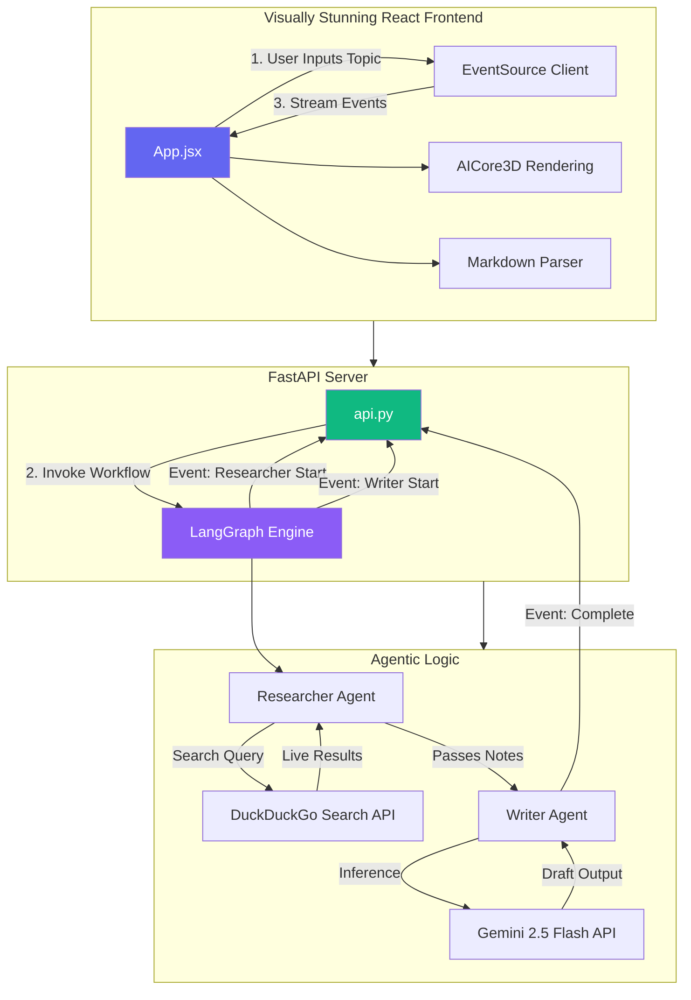
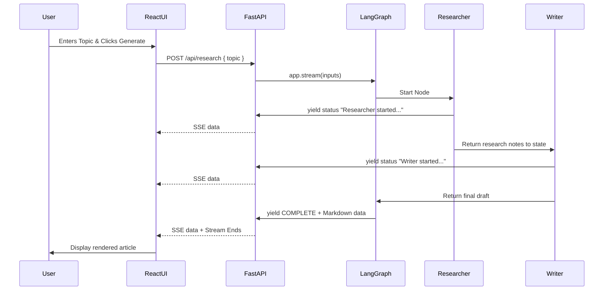

<div align="center">
  <a href="https://github.com/AyushGU12/MULTI-AGENT-SUPPORT">
    
  </a>

  <h3><a href="https://github.com/AyushGU12/MULTI-AGENT-SUPPORT">Live Demo</a> • <a href="#-architecture">Architecture</a> • <a href="#-installation--setup">Installation</a> • <a href="#-api-documentation">API Docs</a></h3>

  <p align="center">
    <a href="https://github.com/AyushGU12/MULTI-AGENT-SUPPORT/stargazers"></a>
    <a href="https://github.com/AyushGU12/MULTI-AGENT-SUPPORT/network/members"></a>
    <a href="https://github.com/AyushGU12/MULTI-AGENT-SUPPORT/issues"></a>
    <a href="https://github.com/AyushGU12/MULTI-AGENT-SUPPORT/blob/main/LICENSE"></a>
  </p>
  
  <a href="https://readme-typing-svg.herokuapp.com?font=Fira+Code&weight=500&size=20&duration=4000&pause=1000&color=6366F1&center=true&vCenter=true&width=600&lines=Multi-Agent+AI+Collaboration;Powered+by+LangGraph+%26+AutoGen;Gemini+2.5+Flash+Orchestration;Real-Time+Event+Streaming;Next-Level+3D+React+Frontend">
    
  </a>
</div>

<br />

---

## 🚀 Professional Overview

**MULTI-AGENT-SUPPORT** is a robust, production-ready AI workflow engine that leverages **LangGraph** and **AutoGen** to orchestrate highly autonomous AI agents. Powered by **Google Gemini 2.5 Flash**, it automates the entire research and synthesis lifecycle. A `Researcher` agent autonomously scours the live web using DuckDuckGo, while a `Writer` agent synthesizes the findings into beautifully structured markdown. 

This is paired with an industry-leading, **Visually Stunning React 3D Interface** utilizing Framer Motion, React Three Fiber, and TSParticles to stream real-time Server-Sent Events (SSE) from the FastAPI backend. 

### ✨ Why this project stands out:
- **True Autonomy**: Bypasses strict LLM chat formats by assigning concrete roles to distinct agents that collaborate and self-correct.
- **Enterprise Streaming**: Utilizes real-time SSE over FastAPI to provide instantaneous UX feedback while long-running LLM inferences process.
- **Aesthetic Dominance**: Goes far beyond standard templates, implementing physics-based animations, glassmorphism, and live WebGL 3D rendering in the browser.

---

## 🧠 System Architecture

MULTI-AGENT-SUPPORT operates on a decoupled Microservices architecture. 



<details>
<summary><b>Click to View High-Level Data Flow Sequence</b></summary>


</details>

---

## 🛠️ Tech Stack & Badges

<div align="center">
  
  **Frontend**<br>
  

  **Backend**<br>
  
  
  **AI & APIs**<br>
  
  
  
  
</div>

---

## 📂 Project Structure

```text
📦 MULTI-AGENT-SUPPORT
 ┣ 📂 frontend               # Vite React Application
 ┃ ┣ 📂 src
 ┃ ┃ ┣ 📂 components
 ┃ ┃ ┃ ┣ 📜 AICore3D.jsx       # React Three Fiber 3D Element
 ┃ ┃ ┃ ┗ 📜 ParticleNetwork.jsx # TSParticles interactive bg
 ┃ ┃ ┣ 📜 App.jsx              # Main UI & SSE consumer
 ┃ ┃ ┣ 📜 index.css            # Glassmorphism & Animations
 ┃ ┃ ┗ 📜 main.jsx             # React entry
 ┃ ┣ 📜 package.json
 ┃ ┗ 📜 vite.config.js
 ┣ 📜 api.py                 # FastAPI backend entrypoint
 ┣ 📜 langgraph_app.py       # LangGraph Orchestration logic
 ┣ 📜 autogen_app.py         # Alternative AutoGen implementation
 ┣ 📜 requirements.txt       # Python dependencies
 ┗ 📜 README.md              # You are here
```

---

## ✨ Features

- ✅ **Autonomous Multi-Agent Collaboration**: Two distinct AI personas operating simultaneously.
- ✅ **Real-time Server-Sent Events (SSE)**: Watch the agents think and pass data live without polling.
- ✅ **React Three Fiber Integration**: 3D objects embedded in the DOM responding to application state.
- ✅ **Dynamic Fault Tolerance**: Fallback protocols implemented if rate-limits block live web searching.
- 🔄 **Dockerization**: Containerization process for seamless Kubernetes deployment.
- 📌 **OAuth2 Authentication**: Planned integration with Clerk for user management.

---

## ⚙️ Installation & Setup

### Prerequisites
- Node.js (v18+)
- Python (3.11+)
- Google Gemini API Key

### Local Setup

**1. Clone the repository**
```bash
git clone https://github.com/AyushGU12/MULTI-AGENT-SUPPORT.git
cd MULTI-AGENT-SUPPORT
```

**2. Setup Backend (FastAPI)**
```bash
# Create and activate virtual environment
python -m venv venv
# On Windows: .\venv\Scripts\activate
# On Mac/Linux: source venv/bin/activate

# Install dependencies
pip install fastapi uvicorn langchain langchain-google-genai duckduckgo-search langgraph pyautogen

# Run the server
export GEMINI_API_KEY="your-api-key"
python api.py
```

**3. Setup Frontend (React)**
```bash
# In a new terminal, navigate to frontend
cd frontend

# Install high-performance UI libraries
npm install

# Start the Vite development server
npm run dev
```

Visit `http://localhost:5173` to interact with the agents!

---

## 📡 API Documentation

### `POST /api/research`

Triggers the LangGraph agent pipeline and opens a streaming connection.

**Request Body:**
```json
{
  "topic": "The future of quantum computing"
}
```

**Response: `text/event-stream`**
```json
data: {"agent": "researcher", "status": "Researcher finished its task.", "data": ""}

data: {"agent": "writer", "status": "Writer finished its task.", "data": "# The Future of Quantum...\n\nQuantum..."}

data: {"agent": "system", "status": "COMPLETE"}
```

---

## 🛡️ Security & Performance Considerations

- **API Security**: The architecture hides the Gemini API key securely on the backend server. The frontend never possesses or transmits sensitive tokens.
- **CORS Handling**: `api.py` utilizes robust CORS middleware to allow modular deployment of the frontend.
- **Scalability**: By utilizing FastAPI's `asyncio` architecture alongside LangGraph's `.stream()`, the backend is inherently non-blocking and can handle hundreds of concurrent agent executions efficiently.
- **Error Boundaries**: DuckDuckGo search rate limits are actively caught and handled using robust `try/except` logic, instructing the `Writer` agent to fallback onto the model's internal paramaterized weights.

---


## 🤝 Contributing

We welcome contributions from the community! Please read our [Contributing Guide](CONTRIBUTING.md) to understand our branching strategy and pull request process.

### Commit Convention
| Emoji | Meaning |
| :---: | :--- |
| ✨ | Introducing new features |
| 🐛 | Fixing a bug |
| 📝 | Writing docs |
| 🎨 | Improving structure / format of the code |

---

<div align="center">
  
  
  <b>Built with ❤️ by <a href="https://github.com/AyushGU12">AyushGU12</a></b>
  
  If you find this project useful, please consider giving it a ⭐!
</div>
